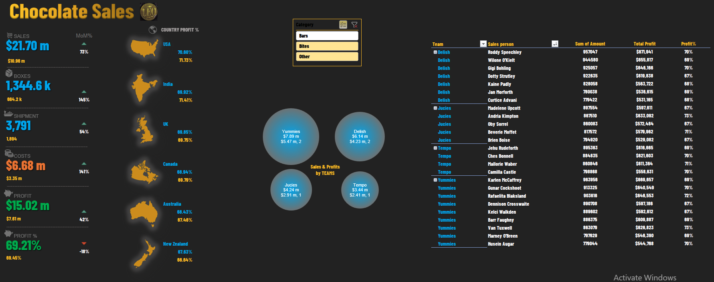

# Excel Dashboard for Chocolate Sales
This Excel Dashboard provides in-depth insights into chocolate sales data. It includes various visualizations of sales, boxes, shipments, cost, profit, Month on Month percentile, country-wise profit percentage based on the category of chocolates.

## Features
Category selection using slicers

Integration of category selection with KPI titles

Sorted country pivot data

Team performance chart using bubble chart

Team performance report

Sleek formatting of slicers

## Overview

Visualization of Sales, Boxes, Shipments, Cost, Profit, Month on Month percentile, Country-wise profit % based the category of chocolates.

Analysis of Top Team performance using bubble chart, and top salesman performance using Team Performance Report.

## Prerequisites
Microsoft Excel with Power Pivot and DAX support.

## Conclusion
In conclusion, this Excel Dashboard for Chocolate Sales provides a comprehensive solution for analyzing and visualizing sales data. With its advanced features such as category selection using slicers, integration with KPI titles, sorted country pivot data, team performance chart using bubble chart, team performance report, and sleek formatting, it provides actionable insights into the sales data. By using DAX and Power Pivot, the dashboard is able to extract meaningful information from large and complex data sets, making it an essential tool for businesses and organizations dealing with chocolate sales. The dashboard can be easily installed and customized to fit the specific needs of a business or organization, making it a versatile and flexible solution for sales data analysis.
